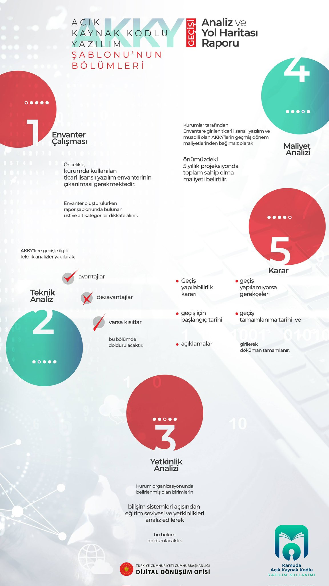

# [Kamuda Açık Kaynak Kodlu Yazılım Kullanımı](https://cbddo.gov.tr/proje-aciklamasi/6776/kamuda-acik-kaynak-kodlu-yazilim-kullanimi)

Hâlihazırda birçok kamu kurumunun bilgi teknolojisi altyapılarında kullanılan ticari lisanslı yazılımlar kurumlarımız açısından oldukça önemli bir maliyet oluşturmaktadır. Hızlanan dijital dönüşüm ile birlikte bu maliyetin önümüzdeki dönemde daha da artması beklenmektedir. Öte yandan, birçok ticari lisanslı yazılımın benzerleri açık kaynak kodlu yazılım (AKKY) olarak da geliştirilmekte ve dünyada yaygın şekilde kullanılmaktadır. AKKY kullanımı, kamunun bilgi teknolojisi harcamalarında maliyet tasarrufunun yanı sıra, yerel yazılım ekosisteminin geliştirilmesi ve siber güvenliğin güçlendirilmesi açısından da önemli bir potansiyel barındırmaktadır.

Bu potansiyelden Türkiye adına mümkün olduğunca faydalanmak amacıyla, kamuda AKKY kullanımını yaygınlaştırmak üzere [Cumhurbaşkanlığı Dijital Dönüşüm Ofisi Başkanlığı](https://cbddo.gov.tr) tarafından hazırlanan "Kamuda Açık Kaynak Kodlu Yazılım Kullanımı" konulu [2023/13 sayılı Cumhurbaşkanlığı Genelgesi](https://www.resmigazete.gov.tr/eskiler/2023/07/20230729-34.pdf), 29/07/2023 tarihli ve 32263 sayılı Resmî Gazete'de yayımlanarak yürürlüğe girmiştir.

Söz konusu Genelge uyarınca kamu kurumları, AKKY Geçişi Analiz ve Yol Haritası Raporunu, [AKKY Geçişi Analiz ve Yol Haritası Raporu Şablonuna](https://cbddo.gov.tr/SharedFolderServer/Projeler/File/AKKY_Gecisi_Analiz_ve_Yol_Haritasi_Raporu_Sablonu.ods) uygun ve TÜBİTAK-ULAKBİM tarafından hazırlanan [Açık Kaynak Kodlu Yazılıma Geçiş Analiz Rehberini](https://cbddo.gov.tr/SharedFolderServer/Projeler/File/Acik_Kaynak_Kodlu_Yazilima_Gecis_Rehberi.pdf) dikkate alacak şekilde hazırlayacak olup Genelge'nin yayım tarihinden itibaren 9 ay içerisinde Cumhurbaşkanlığı Dijital Dönüşüm Ofisi Başkanlığına ileteceklerdir.

## Açık Kaynak Kodlu Yazılıma Geçiş Süreci Aşamaları

### 1. Envanter Çalışması

- Öncelikle, kurumda kullanılan ticari lisanslı yazılım envanterinin çıkarılması gerekmektedir.
- Envanter oluşturulurken rapor şablonunda bulunan üst ve alt kategoriler dikkate alınır.

### 2. Teknik Analiz

AKKY'lere geçişle ilgili teknik analizler yapılarak

- Avantajlar
- Dezavantajlar
- Varsa kısıtlar

bu bölümde doldurulacaktır.

### 3. Yetkinlik Analizi

Kurum organizasyonunda belirlenmiş olan birimlerin bilişim sistemleri açısından eğitim seviyesi ve yetkinlikleri analiz edilerek bu bölüm doldurulacaktır.

### 4. Maliyet Analizi

Kurumlar tarafından envantere girilen ticari lisanslı yazılım ve muadili olan AKKY'lerin geçmiş dönem maliyetlerinden bağımsız olarak önümüzdeki 5 yıllık projeksiyonda toplam sahip olma maliyeti belirtilir.

### 5. Karar

Bu bölümde:

- Geçiş yapılabilirlik kararı, geçiş yapılamıyorsa gerekçeleri
- Geçiş için başlangıç tarihi, geçiş tamamlanma tarihi ve
- Açıklamalar

girilerek doküman tamamlanır.

## Blog

- [Açık Kaynak Dünyasında Yok Yok](https://www.linkedin.com/pulse/a%C3%A7%C4%B1k-kaynak-d%C3%BCnyas%C4%B1nda-yok-ersen-denli/) - Ersen Denli - Bahçelievler Belediyesi
- [Açık Kaynak Kodlu Yazılım (AKKY) Nedir](https://www.domainhizmetleri.com/blog/acik-kaynak-kodlu-yazilim-akky-nedir/) - Barış A. - Domainhizmetleri.com
- [Açık Kaynak Kodlu Yazılımların Güvenlik ve Risk Açısından Değerlendirilmesi](https://medium.com/databulls/a%C3%A7%C4%B1k-kaynak-kodlu-yaz%C4%B1l%C4%B1mlarda-risk-ve-g%C3%BCvenlik-alg%C4%B1s%C4%B1-ac7e7d250b6) - Meltem Yapar
- [Kamuda Açık Kaynak Kodlu Yazılım Kullanımı Dönüşümünde Dikkat Edilmesi Gerekenler](https://www.kuvarssoft.com/pardus-donusumu-blog/kamuda-acik-kaynak-kodlu-yazilim-kullanimi/) - Kuvarssoft Teknoloji

## Haber

- [Avcılar Belediyesi Açık Kaynak Kodlu Yazılıma Geçti](https://www.techinside.com/avcilar-belediyesi-acik-kaynak-kodlu-yazilima-gecti/), [2](https://www.bthaber.com/avcilar-yazilimda-acik-kaynaga-gecti/), [3](https://www.chip.com.tr/haber/avcilar-hem-guvenlik-hem-tasarruf-saglayacak-yazilimda-acik-kaynaga-gecti_161232.html) (2024)
- [Kamuda Açık Kaynağa Yolculuk Başlıyor](https://www.dunya.com/kose-yazisi/kamuda-acik-kaynaga-yolculuk-basliyor/704963) (2023)
- ["Kamuda Açık Kaynak Kodlu Yazılım Kullanımı" Konulu Cumhurbaşkanlığı Genelgesi Resmi Gazete’de Yayımlandı](https://www.pardus.org.tr/haberler/kamuda-acik-kaynak-kodlu-yazilim-kullanimi-konulu-cumhurbaskanligi-genelgesi-resmi-gazetede-yayimlandi/) (2023)
- [Kamuda Açık Kaynak Kodlu Yazılım Kullanılması Maliyetleri Düşürecek](https://www.dunya.com/sektorler/teknoloji/kamuda-acik-kaynak-kodlu-yazilim-kullanilmasi-maliyetleri-dusurecek-haberi-703172) (2023)
- [TOBB Ev Sahipliğinde AKKY Kamu Bilgilendirme Toplantısı](https://www.dunya.com/kose-yazisi/kamuda-acik-kaynak-kodlu-yazilima-geciste-tarihi-bir-gune-daha-imza-atildi/713676), [2](https://twitter.com/ErtanBarut/status/1735592436120875045) (2023)
- [Açık Kaynak Kodlu Yazılım Seferberliği](https://www.sabah.com.tr/yazarlar/sirt/2023/08/12/acik-kaynak-kodlu-yazilim-seferberligi) (2023)
- [Yerli ve Milli İşletim Sistemine Geçen İlk Belediye: Eyüpsultan Belediyesi](https://www.gzt.com/jurnalist/yerli-ve-milli-isletim-sistemine-gecen-ilk-belediye-eyupsultan-belediyesi-3431865), [2](https://t24.com.tr/haber/eyupsultan-belediyesinden-2-milyon-dolarlik-tasarruf,677546), [3](https://www.hukukihaber.net/eyupsultan-belediyesi-turkiyenin-siber-kalkani-ahtapot-icin-kollari-sivadi) (2018-2019)

## Video

- [Açık Seminer| Eyüpsultan Belediyesi'nde Pardus Dönüşümü ve Pardus'tan Haberler](https://www.youtube.com/watch?v=3IJwh6pYx9U)
- [Kamuda Açık Kaynak Kodlu Yazılıma Geçiş](https://www.youtube.com/watch?v=VrIWTaE2hto)

## Yazılım

- [.NET](https://learn.microsoft.com/tr-tr/dotnet/welcome) - Çok Farklı Türde Uygulama Oluşturmaya Yönelik Platformlar Arası Açık kaynak Geliştirici Platformu
- [Ahtapot](https://ahtapot.org.tr/) - Bütünleşik Siber Güvenlik Sistemi
- [Apache Guacamole](https://guacamole.apache.org/) - Platformlar Arası, İstemcisiz Uzak Masaüstü Ağ Geçidi
- [Cacti](https://www.cacti.net/) - Genişletilebilir Operasyonel İzleme ve Hata Yönetimi Çatısı
- [Coslat Hotspot](https://coslat.com/5651-hotspot-cozumleri) - Kamuya Açık Kablosuz Ağ Hizmetleri Yönetim Sistemi
- [ClamAV](https://www.clamav.net/) - Çok Platformlu Antivirüs Yazılımı
- [Django](https://www.djangoproject.com/) - Python ile Hazırlanmış Yüksek Seviyeli Web Çatısı
- [Drupal](https://www.drupal.org/) - Açık Kaynak İçerik Yönetim Sistemi ve İçerik Yönetime Odaklı Altyapı Yazılımı
- [elasticsearch](https://www.elastic.co/) - RESTful Arama ve Analiz Motoru
- [Engerek](https://www.pardus.org.tr/projeler/engerek/) - Kimlik Yönetim Sistemi
- [ETAP](https://www.etap.org.tr/) - Pardus Etkileşimli Tahta Arayüzü
- [Evolution](https://wiki.gnome.org/Apps/Evolution) - Masaüstü E-posta Uygulaması
- [Fedora](https://fedoraproject.org/) - Bir Linux Dağıtımı
- [Flask](https://flask.palletsprojects.com/) - Python ile Yazılmış Mikro Web Çatısı
- [Flutter](https://flutter.dev/) - Google Tarafından Oluşturulan Açık Kaynaklı UI Yazılım Geliştirme Kiti
- [Git](https://git-scm.com/) - Yazılım Versiyon Takip Sistemi
- [GitLab](https://about.gitlab.com/) - Kaynak Kod ve Proje Yönetim Platformu
- [GLPI](https://glpi-project.org/) - Açık Kaynak BT Varlık Yönetim Sistemi
- [Grafana](https://grafana.com/) - Açık Kaynak Veri Analizi ve İzleme Yazılımı
- [Jitsi Meet](https://meet.jit.si/) - Video Konferans ve Anlık Mesajlaşma Sistemi
- [LibreOffice](https://tr.libreoffice.org/) - The Document Foundation Tarafından Geliştirilen Açık kaynak Ofis Yazılımı Seti
- [Liderahenk](https://liderahenk.org/) - Merkezi Yönetim Sistemi
- [Liman MYS](https://liman.havelsan.com.tr/) - Açık Kaynak Merkezi Yönetim Sistemi
- [Lime Survey](https://www.limesurvey.org/) - Anket Uygulaması
- [Moodle](https://moodle.org/) - Uzaktan Eğitim Sistemi
- [MongoDB](https://www.mongodb.com/) - C++ ile Geliştirilmiş Açık Kaynak NoSQL Veritabanı
- [MySQL](https://www.mysql.com/) - Çoklu İş Parçacıklı, Çok Kullanıcılı, Hızlı ve Sağlam Bir Veri Tabanı Yönetim Sistemi
- [NoMachine](https://www.nomachine.com/) - Uzaktan Destek Yazılımı
- [Nextcloud](https://nextcloud.com/) - Dosya Barındırma, Dosya Senkronizasyonu Sistemi
- [osquery](https://github.com/osquery/osquery) - SQL Destekli İşletim Sistemi İzleme ve Analitik Yazılımı
- [Pardus](https://www.pardus.org.tr/) - TÜBİTAK ULAKBİM Tarafından Geliştirilen Debian Tabanlı GNU/Linux Dağıtımı
- [PassBox](https://passbox.io/) - İşletmeler İçin Güvenli Self Servis Şifre Sıfırlama ve OTP
- [PHP](https://www.php.net/) - Çok Geniş Kullanımlı, Genel Amaçlı, İçerisine HTML Gömülebilen Betik ve Programlama Dili
- [PostgreSQL](https://www.postgresql.org/) - Açık Kaynak Güçlü İlişkisel Veritabanı Yönetim Sistemi
- [Proxmox](https://www.proxmox.com/) - Sanallaştırma Ortamı
- [Proxmox Mail Gateway](https://www.proxmox.com/en/proxmox-mail-gateway) - E-posta Güvenlik Çözümü
- [Redis](https://redis.io/) - Veri Yapısı Sunucusu
- [Redmine](https://www.redmine.org/) - Proje Yönetim Sistemi
- [Rocket.Chat](https://www.rocket.chat/) - Anlık İleti ve Video Konferans Yazılımı
- [Rsyslog](https://www.rsyslog.com/) - Hızlı Log İşleme Sistemi
- [Sambabox](https://sambabox.io/) - Samba4 Alt Yapılı Aktif Dizin Yönetimi
- [SonarQube](https://www.sonarsource.com/products/sonarqube/) - Kod Kalitesi, Güvenlik ve Statik Analiz Aracı
- [TaliaDomain](https://taliadomain.com/) - Açık Kaynak Domain Kurulum, Yönetim ve İzleme Sistemi
- [Ubuntu](https://ubuntu.com/) - Bir Linux Dağıtımı
- [Wazuh](https://wazuh.com/) - Uç Noktalar ve Bulut İçin XDR ve SIEM Korumasını Birleştiren Açık Kaynak Güvenlik Platformu
- [WordPress](https://tr.wordpress.org/) - PHP Dilinde Yazılmış Açık Kaynak İçerik Yönetim Sistemi
- [Zabbix](https://www.zabbix.com/) - Açık Kaynak Ağ ve Uygulama İzleme Yazılımı
- [Zimbra](https://www.zimbra.com/) - E-posta Sunucusu

## Donanım

## Firma

- [Açık Kaynak Kodlu Yazılım Ekosistemi Firma Bilgi Formu](https://forms.gle/RrbwKTqA3yCmYiDT8)

Aşağıda kamuda açık kaynak kodlu yazılım kullanımı konusunda destek/hizmet veren firmaların alfabetik bir listesini bulabilirsiniz.

- [Antandros Teknoloji](https://akky.com.tr/)
- [Artistanbul](https://www.artistanbul.io/)
- [BeyazNet](https://www.beyaz.net/)
- [Özgür Yazılım A.Ş.](https://www.ozguryazilim.com.tr/)
- [Profelis](https://profelis.com.tr/)

## Kurum

- [Hazine ve Maliye Bakanlığı Bilgi Teknolojileri Genel Müdürlüğü](https://btgm.hmb.gov.tr/), [2](https://btgm.hmb.gov.tr/haberler/gelecegi-insa-ederken-acik-kaynak-kodlu-yazilimlarin-gucuyle-ilerliyoruz), [3](https://btgm.hmb.gov.tr/haberler/acik-kaynak-kodlu-yazilimlar-ile-gelistirdigimiz-kamu-filo-bilgi-sistemini-devreye-aliyoruz)
- [Okullarda Milli İşletim Sistemi Pardus Yaygınlaştırılacak](https://www.meb.gov.tr/okullarda-mill-isletim-sistemi-pardus-yayginlastirilacak/haber/31964/tr)
- [İllere Bağlı İlçelerin Deprem Tehlike Değerlerinin Açık Kaynak Kodlu CBS ile Belirlenmesi](https://webdosya.csb.gov.tr/db/cbsgunu/webmenu/webmenu15756.pdf)

## Dernek/Platform

- [Linux Kullanıcıları Derneği](https://www.lkd.org.tr/)
- [Özgür Yazılım Derneği](https://www.oyd.org.tr/)
- [Özgür Yazılım Kullanıcıları Derneği](https://www.oyakder.org.tr/)
- [TOBB Türkiye Yazılım Meclisi](https://tobbyazilim.org/)
- [Türkiye Açık Kaynak Platformu](https://www.turkiyeacikkaynakplatformu.com/)

## Kişi

- [Ali Orhun AKKİRMAN](https://www.linkedin.com/in/alorak), [2](https://github.com/aliorhun)
- [Hüseyin GÜÇ](https://www.linkedin.com/in/huseyin-guc), [2](https://opensource.com/users/hguc)

## İnternet Sitesi

- [Özgür Lisanslar](https://www.ozgurlisanslar.org.tr/) - Linux Kullanıcıları Derneği Tarafından Yapılan Yaygın Özgür Lisansların Türkçeleştirilmesi Çalışması
- [Özgür yazılım lisansları - Vikipedi](https://tr.wikipedia.org/wiki/Kategori:%C3%96zg%C3%BCr_yaz%C4%B1l%C4%B1m_lisanslar%C4%B1) - Özgür Yazılım Lisansları Listesi
- [Lisanslar - GNU Projesi](https://www.gnu.org/licenses/licenses.tr.html) - Özgür Yazılım Lisansları

## Makale

- [Kamuda Açık Kaynak Kodlu Yazılım Kullanımı Genelgesi](https://www.bilecik.edu.tr/dosya/19377_5532_AKKY%20Sunum.pdf) - Bilecik Şeyh Edebali Üniversitesi Bilgi İşlem Daire Başkanlığı (2023)
- [Kamu Kurumlarında Açık Kaynak Kodlu Yazılım Kullanımına Karşı Yönetici Direnci Üzerine Bir Araştırma](https://earsiv.kmu.edu.tr/xmlui/bitstream/handle/11492/5457/%C3%96zcan%2C%20Mahmut.pdf?sequence=1&isAllowed=y) - Mahmut ÖZCAN (2020)
- [İşletmelerde Milli ve Açık Kaynak Kodlu Bir İşletim Sistemi Uygulama Süreci: Pardus Örneği](http://acikerisim.gedik.edu.tr:8080/xmlui/bitstream/handle/11501/134/%20BRAH%20M%20SARIKAYA.pdf?sequence=1) - İbrahim SARIKAYA (2019)
- [Ülkemizde Kamu Kuruluşlarında Kullanılan Yazılımların Yerli Yazılım İle Tek Çatı Altında Toplanması](https://www.sadab.org/FileUpload/bs701867/File/ulkemizde_kamu_kuruluslarinda_yerli_yazilim_son.pdf) - Alper AYTEKİN, Fatma TÜMİNÇİN (2018)
- [Kamu Kurumlarında Açık Kaynak Kodlu Yazılımların Kullanımı](https://dergipark.org.tr/tr/pub/seyad/issue/53367/709521) - Mustafa Fedai ÇAVUŞ, Halenur Soysal KURT (2017)
- [Kamuda Açık Kaynak Kodlu Yazılım Kullanımı](http://www.bilgitoplumu.gov.tr/Documents/1/Diger/Kamuda_Acik_Kaynak_Kullanimi_Calisma_Raporu.pdf) - M. Rașit ÖZDAȘ (2012)

## Örnek

- [Ankara Üniversitesi Bilgi İşlem Daire Başkanlığı ](https://bid.ankara.edu.tr/2024/01/01/e-beyas-acik-kaynak-kod-donusumu/)
- [Bilecik Şeyh Edebali Üniversitesi Bilgi İşlem Daire Başkanlığı AKKY Genelgesi Çalışması](https://wiki.bilecik.edu.tr/tr/YARDIM/akkygenelge)
- [Diyanet Açık Kaynak](https://acikkaynak.diyanet.gov.tr/)
- [Selçuk Üniversitesi Bilgi İşlem Daire Başkanlığı](https://www.selcuk.edu.tr/Birim/daire-baskanliklari/bilgi_islem/1951/acik-kaynak/53178)
- [Ziraat Katılım Bankası](https://eksisozluk111.com/entry/139301960)

